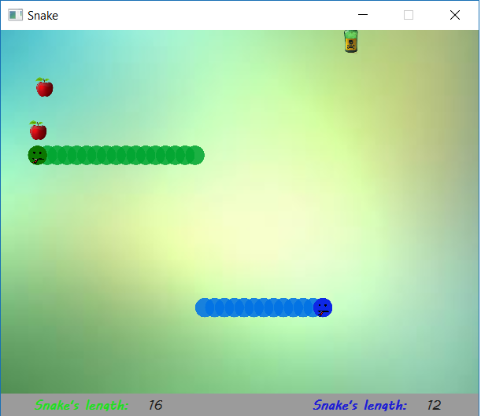

# Snake_WPF

  
  

  

  In this game, we control the snake, and eat apples thanks to which the snake grows and we get points.  
  If the snake eats poison or bites itself or the opponent, the player loses. 
  The player who scored the most points is saved.
 

 This is a game with one and two players mode. 

  
  

  

  
  

  

 In option we can on/off sounds. 

  
  

